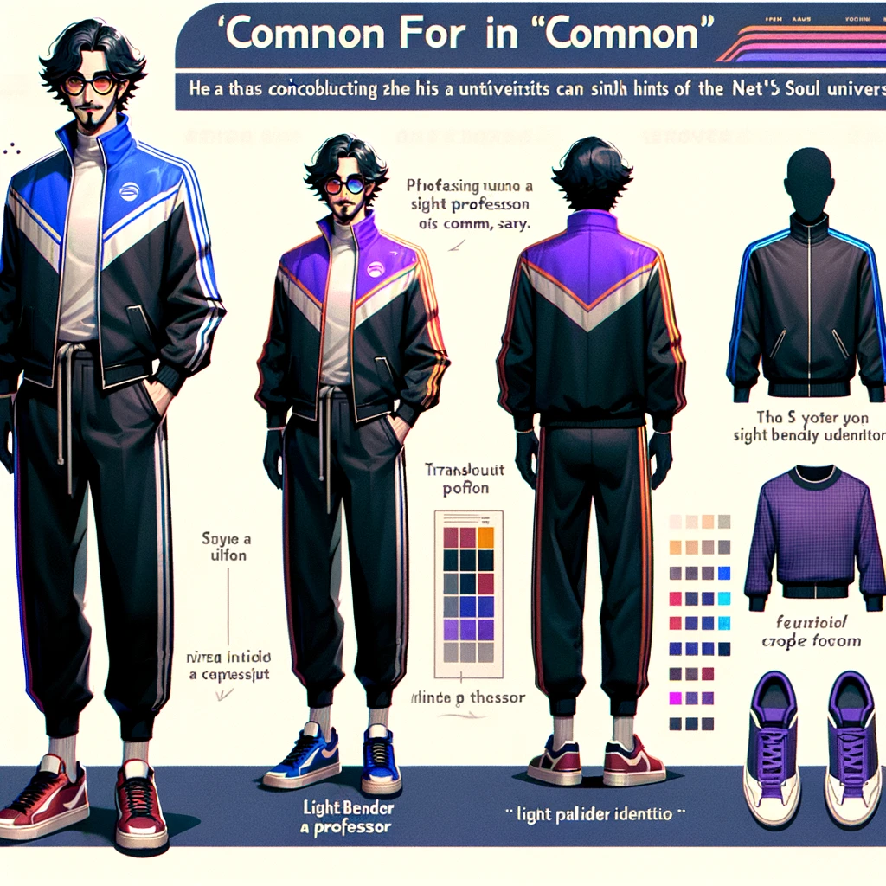
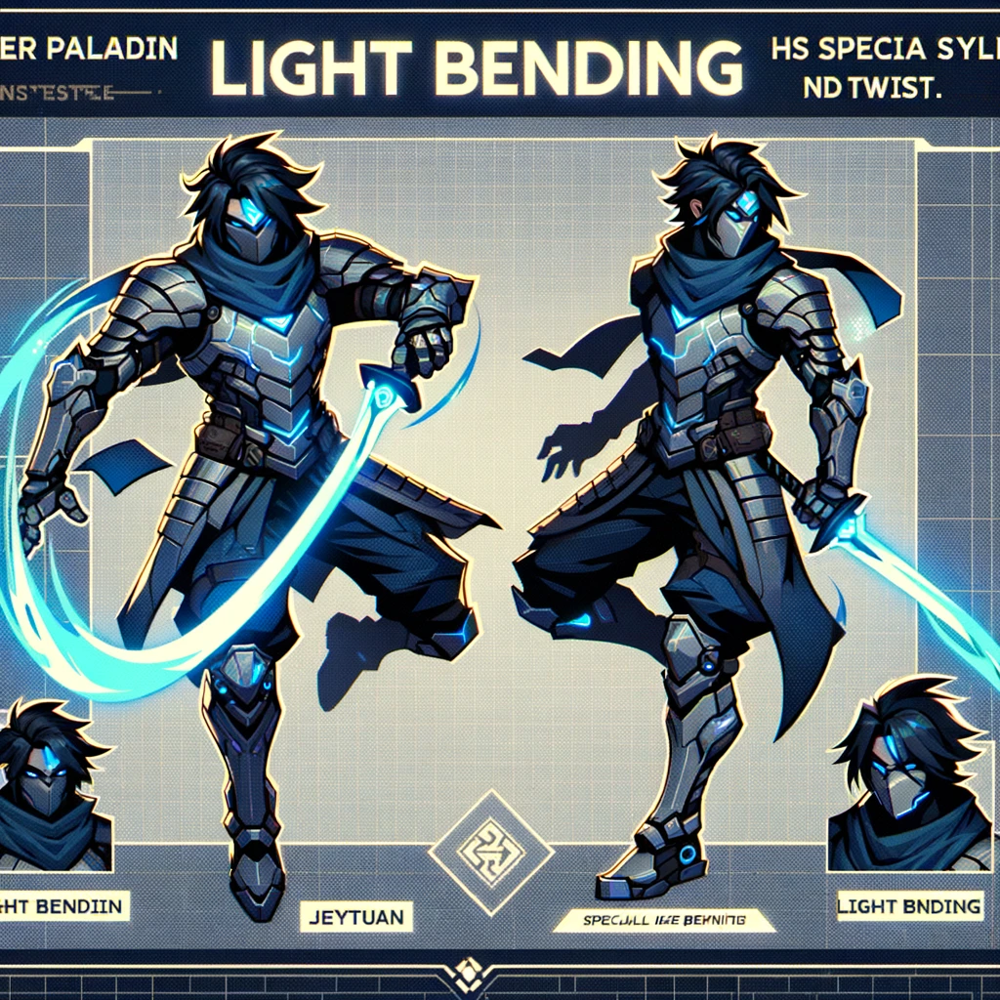
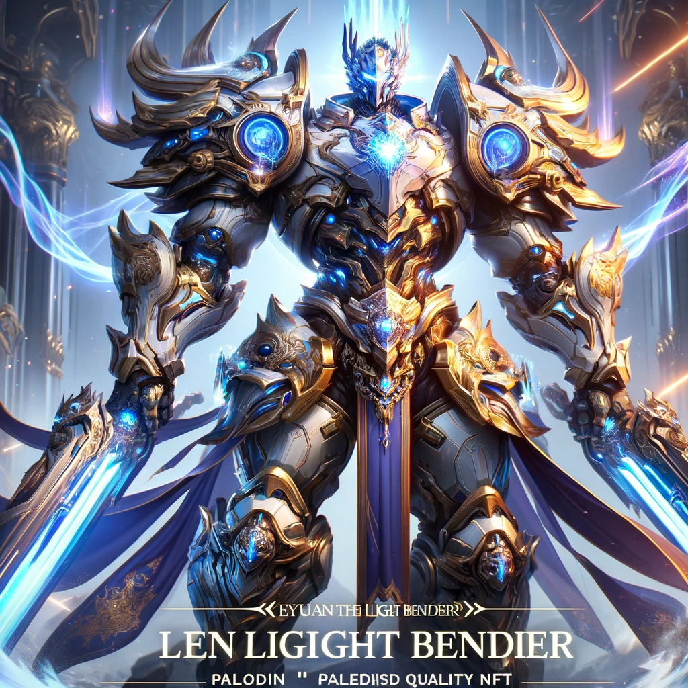
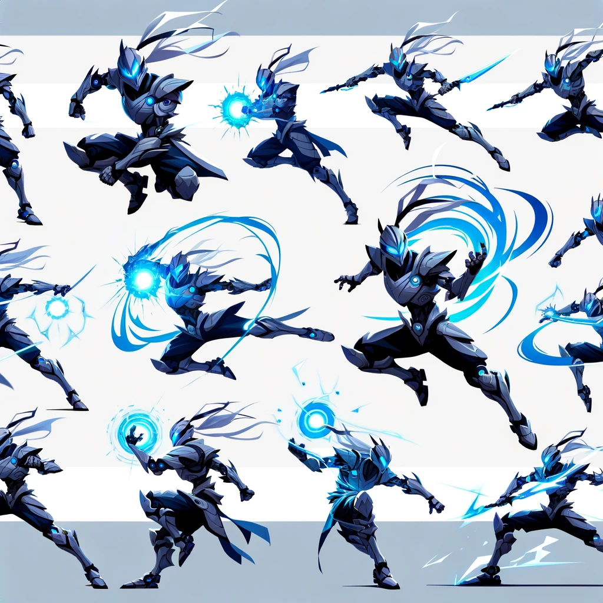
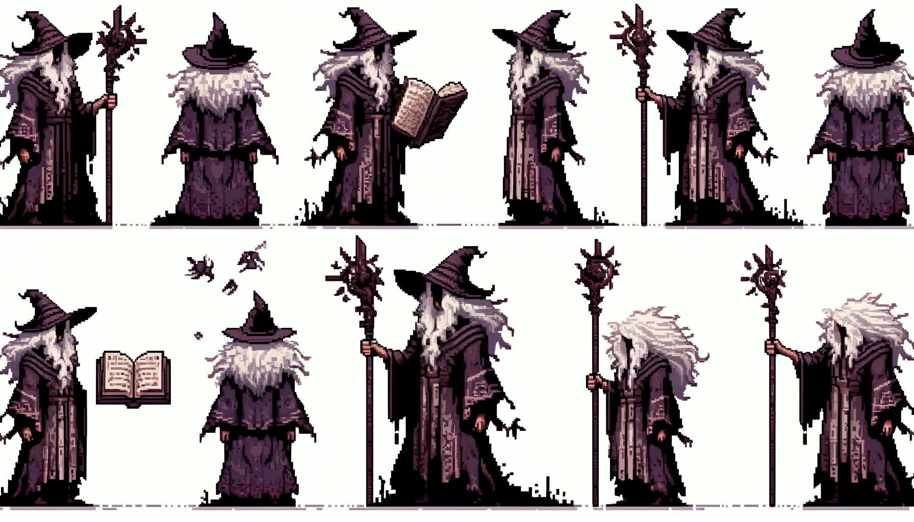
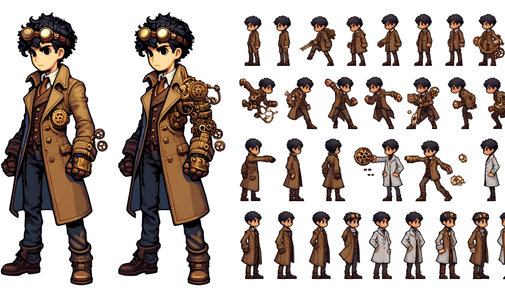
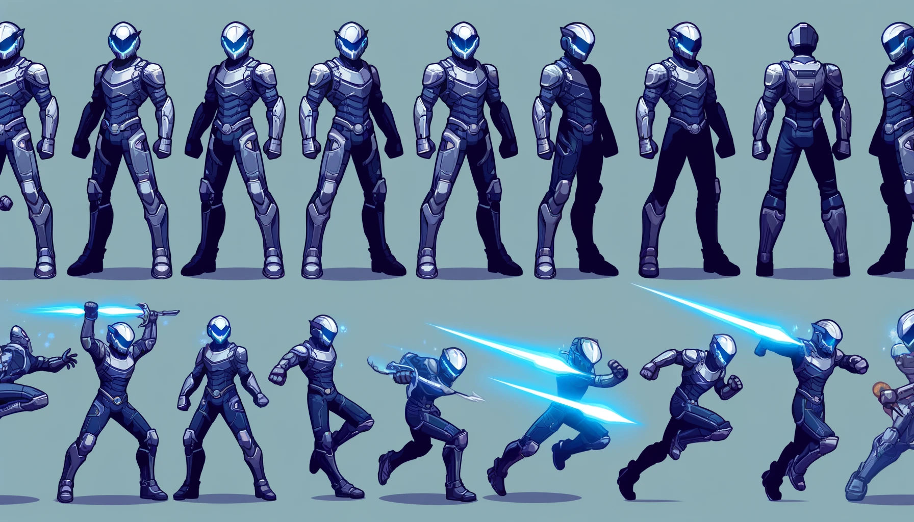
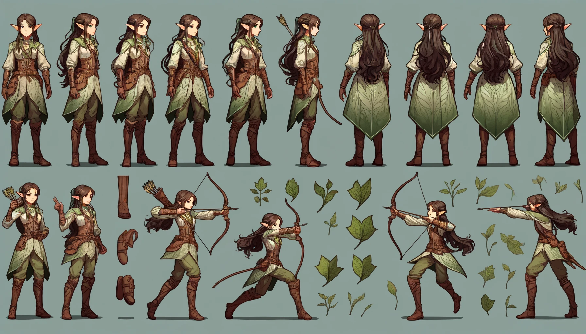

# AI Sprite Generation Report

## Introduction
This report outlines the learnings and methodologies derived from our experiments with AI-driven sprite generation for the Netsoul game project. Our goal was to develop a reliable workflow for creating consistent and visually appealing game assets using advanced AI techniques.

## Key Learnings

- **Prompt Engineering:** Enhanced prompt structures led to more accurate sprite generation.
- **Skeleton Tracking Integration:** Utilizing skeleton tracking technology improved pose accuracy and consistency.

# Netsoul Game Project - AI-Generated NFT Assets Report

## Introduction

This report outlines the use of advanced AI tools to assist in the creation of NFT assets for the early-phase game project, Netsoul. These tools have facilitated the generation of character assets at varying levels of rarity, each depicting unique styles and themes consistent with the game's lore and aesthetic requirements.

## AI-Generated Character Concepts

The character 'Jeytuan', a pivotal figure in the Netsoul universe, was conceptualized in various forms to represent different rarity tiers. These assets were designed to enhance player engagement by offering diverse visual representations that align with in-game status and achievements.

### Common Rarity - Jeytuan as a University Professor

- **Description:** Jeytuan in his 'common' form appears as a university professor, dressed in a tracksuit with retro synth style influences. This everyday appearance incorporates subtle hints of his Light Bender identity, blending into the casual setting while hinting at deeper lore elements.
- **Visual Style:** The tracksuit integrates elements reminiscent of his ninja and paladin forms, ensuring the character remains vibrant and relatable within the fantasy cyber universe of Netsoul.
- **Asset Path:** 

### Uncommon Rarity - Jeytuan the Cyber Paladin

- **Description:** In the 'uncommon' rarity, Jeytuan is envisioned as a cyber paladin with ninja-like agility, showcasing his special power of light bending. The character combines cyberpunk elements with traditional paladin aesthetics to create a dynamic and heroic persona.
- **Visual Style:** This representation is suitable for a modern, high-action video game, portraying strength and agility.
- **Asset Path:** 

### Epic Rarity - Jeytuan the Light Bender

- **Description:** For the 'epic' rarity level, Jeytuan assumes his paladin tank form. This version features heavier armor with a blend of futuristic and celestial elements, depicting him as a formidable and heroic figure.
- **Visual Style:** The majestic and ornate armor emphasizes high-tech qualities, with a pose that showcases his full glory, making him appear powerful and awe-inspiring in the fantasy cyber universe.
- **Asset Path:** 

## Progression with Sprite Sheet Poses

As part of our ongoing efforts to enrich the visual experience in Netsoul, we have focused on enhancing the animation capabilities of our characters through detailed sprite sheet poses. Below we detail the advancements made in animating 'Jeytuan', our key character, and highlight the contributions of our team in refining sprite sheet generation for various character designs.

### Attack Moveset Animations for 'Jeytuan'

- **Description:** Extending on the previously established art style, we've developed various animation designs for 'Jeytuan'. These designs capture a range of dynamic actions including attacking, defending, and utilizing his special light bending abilities.
- **Visual Impact:** Each pose is crafted to be dynamic and expressive, highlighting Jeytuan's abilities as a cyber paladin with ninja-like agility and strength. The consistent art style maintains the visual coherence of the character, emphasizing motion and energy in each frame.
- **Asset Path:** 

### Enhancements in Sprite Sheet Consistency

To further support the animation needs of our 2D game, we have made significant strides in improving the consistency of our sprite sheets. This advancement ensures that each character not only looks great but is also ready for seamless integration into game scenarios.

#### Key Contributions by tben140

tben140's work has been instrumental in developing techniques that improve the control and consistency of sprite generation, critical for producing usable game animations. Here are some of the standout sprite sheets created under his guidance:

- **Lofi Dark Wizard:**
  - **Description:** This sprite sheet features the Lofi Dark Wizard in various poses, tailored for spell-casting animations and idle movements.
  - **Asset Path:** 

- **Steampunk Inventor:**
  - **Description:** Capturing the essence of innovation and mechanics, the Steampunk Inventor sprite sheet includes poses for inventing and combat scenarios.
  - **Asset Path:** 

- **Metal Knight:**
  - **Description:** Designed for combat and defense animations, the Metal Knight sprite sheet displays a variety of armored poses.
  - **Asset Path:** 

- **Elven Archer:**
  - **Description:** Showcasing agility and precision, the Elven Archer sprite sheet is perfect for depicting ranged attacks and evasive maneuvers.
  - **Asset Path:** 

## Conclusion

Through collaborative efforts and the application of advanced AI tools, we have not only enhanced the visual narrative of Netsoul but also improved the functional aspects of game design. Our progress in sprite sheet development marks a significant step towards realizing fully animated and immersive gameplay experiences.

## Future Work

As we look to the future, several key areas of development stand out in our quest to further enhance the Netsoul game project. A significant focus will be on automating and refining AI workflows to streamline the generation and implementation of image assets for the game engine.

### Automation of Sprite Frame Cropping

- **Objective:** Automate the process of cropping out individual frames from sprite sheets. This would reduce manual labor and increase the speed at which assets can be integrated into the game engine.
- **Methodology:** We plan to develop or integrate AI-driven tools that can accurately recognize and extract individual animation frames from a completed sprite sheet. This process involves using machine learning models trained to identify the boundaries of each frame based on visual cues and predefined alignment markers.

### Enhanced AI Workflows for Game Asset Generation

- **AI-Driven Asset Refinement:** Leverage AI to not only generate initial designs but also refine these designs to meet specific aesthetic and functional criteria set by the game developers.
- **Dynamic Asset Adjustment:** Implement AI systems capable of dynamically adjusting assets based on in-game feedback or performance metrics. This could involve resizing, re-coloring, or even altering the complexity of assets to optimize game performance without manual intervention.
- **Integration with Game Engines:** Develop plugins or middleware that allow for seamless integration of AI-generated assets into popular game engines such as Unity or Unreal Engine. This would facilitate a more fluid workflow from asset creation to game implementation, reducing the friction typically associated with importing and configuring assets in the game development pipeline.

### AI-Assisted Animation and Interaction

- **Automated Animation Sequences:** Explore the use of AI to automate the generation of complex animation sequences, potentially reducing the workload on animators and speeding up the production cycle.
- **Context-Aware Asset Generation:** Develop AI models that understand the context of the game environment and generate assets that are not only visually appropriate but also behaviorally aligned with the game’s mechanics and story.

### Collaborative AI Tools for Design Teams

- **Collaborative Tools:** Implement AI-powered collaborative tools that allow designers and developers to work together in real-time, with AI suggestions aiding in the creative process. This could enhance creativity and efficiency, allowing for real-time adjustments and iterations based on AI-generated recommendations.

These advancements would not only streamline the asset creation process but also enhance the creative capabilities of our design team, pushing the boundaries of what is possible in game development. By automating tedious tasks and refining the integration of AI in our workflow, we aim to achieve a more robust, flexible, and innovative asset generation system for Netsoul.

